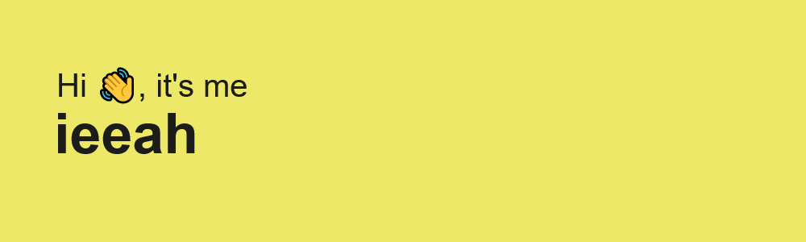

# Who am I?

Development has always fascinated me, but I did never really approcahed it until september 2021 when I decided to dedicate myself to this world.
I've then signed up at a Web Development Bootcamp, and after it, I did a Java course to learn the basics of the language, and then I landed my first job as a frontend web developer in April 2022! :tada::tada::tada:

My work projects are stored in a Gitlab company account, that's why my Github it feels kind of empty, but I'll try filling it with some side projects.

## Learning

### What am I currently learning
- Since the company where I work use React for the frontend I'm trying to study the best ways to use and optimize it (BUT I do really prefer Vue over React, so sometimes I do like using it in my side projects.)
- I am trying to study a lot of theory about JavaScript, it's engine and the best way to program with it!
- I am a CSS addicted, i really like it, and I do love writing it, so I always look for his brand new features! (Thank's God for giving us Kevin powell!)

### What I'd like to study
- In the Bootcamp we also used PHP, i kind of like it, but I do like a lot Laravel. I haven't used it for a lot now, but I'd like to re-grasp it.
- Same for Vue :joy:
- All of the communication protocols, how web works, http/https etc etc

### Training Projects :video_game:
I try in my spare time to work on some side projects to sharpen the blade of my abilities and making my toolbox heavier. :hammer_and_wrench:

**_PS: This is going to be the best "how to start things and don't finish them" guide in the universe :ok_hand:_**
- [MineSweeper:](https://github.com/ieeah/Campo-Minato) (Yes, another MineSweeper clone) I started developing this game during my first Bootcamp, I decided doing it in vanillaJS, the game is working, I think it's pretty performant, BUT I'm struggling a lot with adding the "expansion feature" (when you click on a tile with zero bombs in the immediate vicinity it should expand all the close tiles, and recursively doing it for every close "empty tile").
- [Snickerz:](https://github.com/ieeah/snickerz) It's a fake sneakers e-commerce, I basically did only the header but once finished, is gonna be a nice project! :laughing: 
- Memory game: It's still an idea and I haven't started coding it yet, but I've written the roadmap to make it reality, now I just need some more spare time! :disappointed:
- [Starbucks Rewards clone:](https://github.com/ieeah/starbucks-rewards-clone) I don't remember the website where I've got this challenge from, (sorry :pray:) but I did this [Starbucks Rewards](https://www.starbucks.com/rewards) page using HTML - SCSS - VanillaJS.
`Edit: I noticed a little bug in the rewards carousel visualization, I'll fix that sooner or later`
- [Carrefour:](https://github.com/ieeah/carrefour-project) We looked at the ["Carrefour - Shop Online"](https://www.carrefour.it/spesa-online/) page to make a kind-of-a-clone for this group project.
- [Deliveboo:](https://github.com/ieeah/deliveboo) Similar to the upper "Carrefour Clone", but more complex and large since this was meant to be the final exercise of the Bootcamp, is a full stack clone website of a food-delivery-platform.
Even though the name it clearly recall Deliveroo, it's just the name, the appareance and functionality aren't comparable. Built with VUE and Laravel 8. `Notice: please don't look at the cleanliness of the code, it's terrible, I already know` :neutral_face:
- [Boolflix:](https://github.com/ieeah/vue-boolflix) `Danger! This website is really ugly to look at!` But was one of the first attempts with using a public API (the IMDb one).
- An utilities-library, not because is gonna be better than the millions of library out there, but because I do wanna learn how to write npm packages and because I like the idea of using my own library when possible.
- a bunch of other really small things I don't think they own this place :shit:

## Work Projects :hammer:
I can't deeply explain them, but I can tell that:

- Our main customers are Italian cities halls, and we usually sell thems things like:
  - tribute portlets
  - demographic portlets
  - software to create and manage appointments and "agenda"
- We also work a lot with hospitals and private health centers providing them software for their management
 I'm usually involved in the frontend side of "cities halls projects", but I'm rarely involved in the backed too, using Java and SpringBoot.
 
 ## Few Stats :bar_chart:
 
 Actually that's not a lot to say and show, expecially here on Github, but I really liked this cards and I wanted to put them on this readme :wink:
 
 ### Most used languages
 
 
<!--
**ieeah/ieeah** is a ✨ _special_ ✨ repository because its `README.md` (this file) appears on your GitHub profile.

Here are some ideas to get you started:

- 🤔 I’m looking for help with ...
- 💬 Ask me about ...
- 📫 How to reach me: ...
- 😄 Pronouns: ...
- ⚡ Fun fact: ...
-->

